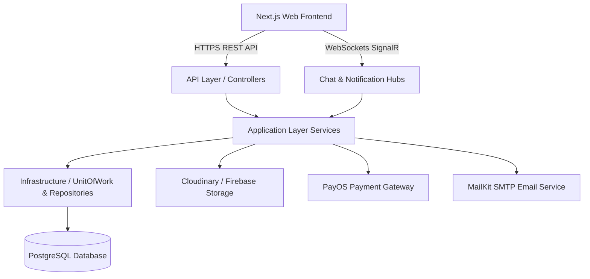
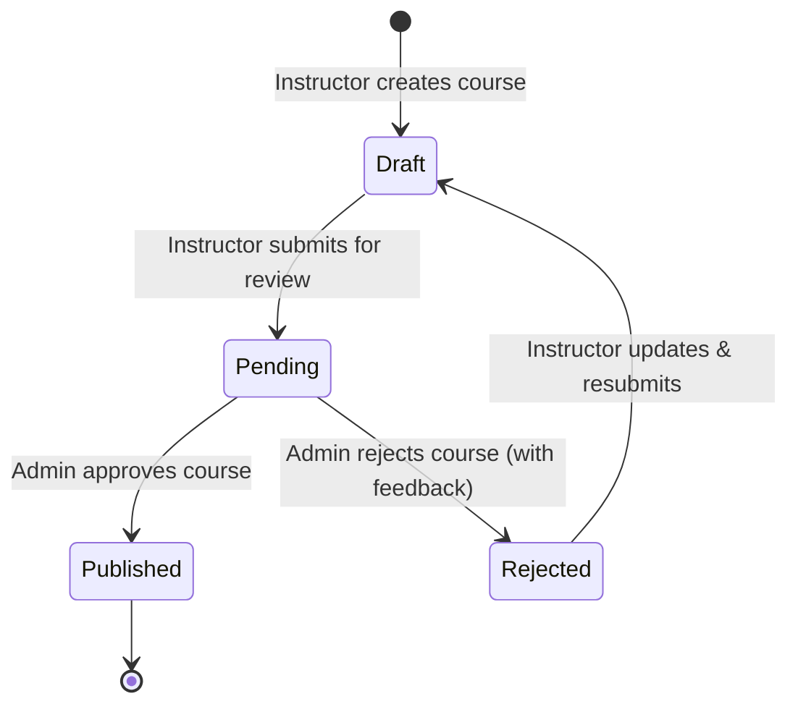

<div align="center">

# 🎓 Online Learning Platform — Backend API (`PRN232_BE`)

[](https://dotnet.microsoft.com/)
[](https://www.postgresql.org/)
[](https://jwt.io/)
[](https://dotnet.microsoft.com/apps/aspnet/signalr)
[](LICENSE)

An enterprise-grade, high-performance **RESTful Web API** backend powering a full-stack e-learning platform. Built with **.NET 8 (ASP.NET Core)** and **PostgreSQL**, this repository strictly follows **Onion Architecture** (Clean Architecture) and **Domain-Driven Design (DDD)** principles.

[Features](#-key-features) • [Architecture](#-architecture--design-patterns) • [API Routes](#-api-endpoint-reference) • [SignalR Hubs](#-real-time-signalr-hubs) • [Configuration](#-environment-configuration) • [Quickstart](#-getting-started)

</div>

---

## 📋 Table of Contents

- [Overview](#overview)
- [Key Features](#-key-features)
- [Architecture & Design Patterns](#-architecture--design-patterns)
- [System Workflow Diagrams](#-system-workflow-diagrams)
- [Technology Stack](#-technology-stack)
- [API Endpoint Reference](#-api-endpoint-reference)
- [Real-Time SignalR Hubs](#-real-time-signalr-hubs)
- [Environment Configuration](#-environment-configuration)
- [Getting Started](#-getting-started)
- [Database & Migrations](#-database--migrations)
- [Troubleshooting](#-troubleshooting)

---

## Overview

The `PRN232_BE` project acts as the core business engine for an online learning ecosystem. It manages user identities, hierarchical course content (Courses ➔ Modules ➔ Lessons ➔ Items/Resources), student progress tracking, PayOS payment processing, instructor earnings wallets, automated certificate issuing, and real-time interactive communications via SignalR.

---

## ✨ Key Features

### 🔐 1. Authentication & Security
- **JWT Authentication**: Token-based authentication with custom claims (`sub`, `role`, `email`, `name`).
- **Role-Based Access Control (RBAC)**: Strict role guards for `Student`, `Instructor`, and `Admin`.
- **SignalR Token Integration**: Custom `JwtBearerEvents` handler allowing JWT tokens passed via query parameters (`access_token`) for WebSocket connections.

### 📚 2. Rich Course & Content Management
- **Hierarchical Course Tree**: Courses contain Modules; Modules contain Lessons; Lessons contain multi-modal Items (Video, Article, Quiz).
- **Multi-Source Video & Document Support**: Integrates with Cloudinary, Firebase Storage, and external media URLs.
- **Publishing Review State Machine**: `Draft (0)` ➔ `Pending (1)` ➔ `Published (2)` / `Rejected (3)`.

### 💳 3. Payment Gateway & Wallet Engine
- **PayOS Payment Gateway Integration**: Generates official PayOS checkout links with webhook signature verification.
- **Development Sandbox Fallback**: Built-in mock payment handler ensuring uninterrupted local testing when payment keys are absent.
- **Instructor Earning Wallets**: Tracks balance, transaction histories, and supports Admin payout approval workflows.

### 💬 4. Real-Time Interactions (SignalR)
- **Direct Messaging (`ChatHub`)**: Real-time 1-on-1 messaging between Students and Instructors with persistent message history.
- **Push Notifications (`NotificationHub`)**: Live broadcast updates for course reviews, wallet transactions, and system notifications.

### 🎓 5. Automated Progress & Certification
- Lesson completion tracking with progress percentage calculations.
- Automatic PDF certificate generation upon 100% course completion.

### 🛡️ 6. Admin Management & Comprehensive Content Reviewer
- Platform revenue analytics and cashflow financial reports.
- User management (Ban/Unban, Role modifications, Soft deletion).
- **Interactive Course Inspector**: Full curriculum payload inspection (Videos, Articles, Quiz Question Counts) for pre-publish quality assurance.

---

## 🏛 Architecture & Design Patterns

The solution is architected according to **Onion / Clean Architecture**, separating core domain logic from framework-specific infrastructure and presentation layers.

```
PRN232_BE/
├── API/                               # Presentation Layer
│   ├── Controllers/                   # RESTful API Endpoints (Admin, Auth, Course, Instructor, Student)
│   ├── Hubs/                          # SignalR Real-Time Hubs (ChatHub, NotificationHub)
│   └── Program.cs                     # Service Container, Middleware Pipeline & CORS Config
│
├── Application/                       # Business Logic Layer
│   ├── IServices/ & Services/         # Domain Services (Course, Payment, Wallet, Message, Admin)
│   ├── Requests/ & Responses/         # Data Transfer Objects (DTOs)
│   ├── MyMapper/                      # AutoMapper Object Mapping Profiles
│   └── AppSetting.cs                  # Strongly-typed Configuration Binding
│
├── Domain/                            # Domain Core Layer
│   ├── Entities/                      # Core Business Entities (Course, User, Lesson, Payment, etc.)
│   └── AppDbContext.cs                # EF Core Database Context & Model Configurations
│
└── Infrastructure/                    # Infrastructure Layer
    ├── Repositories/                  # Generic Repository Implementation
    └── UnitOfWork.cs                  # Unit of Work Pattern for Transaction Management
```

---

## 🔄 System Workflow Diagrams

### 1. High-Level Architecture Diagram



### 2. Course Publishing Lifecycle



---

## 💻 Technology Stack

| Component | Technology / Library | Version | Purpose |
| :--- | :--- | :--- | :--- |
| **Framework** | .NET (ASP.NET Core Web API) | `8.0` | Core Web Server & API Framework |
| **Database** | PostgreSQL | `16.0+` | Primary Relational Data Store |
| **ORM** | Entity Framework Core | `8.0.x` | Database Abstraction & Migrations |
| **Data Provider** | `Npgsql.EntityFrameworkCore.PostgreSQL` | `8.0.x` | PostgreSQL EF Core Driver |
| **Real-Time** | ASP.NET Core SignalR | `8.0` | WebSockets & Long-Polling Push Engine |
| **Authentication** | `Microsoft.AspNetCore.Authentication.JwtBearer` | `8.0` | JWT Authentication & Security |
| **Object Mapper** | AutoMapper | `12.x` | Entity to DTO Mapping |
| **Payment Gateway** | PayOS SDK / REST API | Latest | Online Banking & QR Payment |
| **Media Storage** | CloudinaryDotNet & Firebase Admin | Latest | Image & Video Cloud Asset Hosting |
| **Emailing** | MailKit & MimeKit | `4.x` | SMTP Email Dispatching |
| **API Docs** | Swashbuckle (Swagger UI) | `6.5+` | Interactive OpenAPI Specification |

---

## 🛣 API Endpoint Reference

The API endpoints are strictly grouped into logical controllers. Detailed interactive documentation is available at `/swagger`.

### 🔐 Authentication (`/api/Auth`)
| Method | Endpoint | Access | Description |
| :--- | :--- | :--- | :--- |
| `POST` | `/api/Auth/register` | Public | Register a new student account |
| `POST` | `/api/Auth/login` | Public | Authenticate user & return JWT token |
| `GET` | `/api/Auth/profile` | Authenticated | Retrieve current user profile |

### 📚 Courses & Catalog (`/api/Courses`)
| Method | Endpoint | Access | Description |
| :--- | :--- | :--- | :--- |
| `GET` | `/api/Courses` | Public | Fetch published courses with search & filter |
| `GET` | `/api/Courses/{courseId}` | Public | Get public details and curriculum structure |
| `GET` | `/api/Courses/categories` | Public | List available course categories |

### 🎓 Student Operations (`/api/Student/StudentCourses`)
| Method | Endpoint | Access | Description |
| :--- | :--- | :--- | :--- |
| `GET` | `/api/Student/StudentCourses/my-courses` | Student | Get student's enrolled courses |
| `POST` | `/api/Student/StudentCourses/{courseId}/enroll` | Student | Enroll in a free course directly |
| `POST` | `/api/Student/StudentCourses/{courseId}/checkout` | Student | Initiate PayOS checkout / Sandbox payment |
| `GET` | `/api/Student/StudentLearning/{courseId}` | Student | Fetch learning player data & lesson content |
| `POST` | `/api/Student/StudentProgress/update` | Student | Mark lesson items as completed |
| `GET` | `/api/Student/StudentCertificates/{courseId}` | Student | Generate/view completion certificate |

### 👨‍🏫 Instructor Workspace (`/api/Instructor`)
| Method | Endpoint | Access | Description |
| :--- | :--- | :--- | :--- |
| `GET` | `/api/Instructor/courses` | Instructor | Manage instructor's created courses |
| `POST` | `/api/Instructor/courses` | Instructor | Create new course draft |
| `PUT` | `/api/Instructor/courses/{courseId}` | Instructor | Update course metadata |
| `POST` | `/api/Instructor/courses/{courseId}/submit` | Instructor | Submit course for Admin review |
| `GET` | `/api/Instructor/wallet` | Instructor | Check earnings balance & request payouts |

### 🛡️ Admin Portal (`/api/Admin`)
| Method | Endpoint | Access | Description |
| :--- | :--- | :--- | :--- |
| `GET` | `/api/Admin/overview` | Admin | Retrieve platform KPIs & financial summary |
| `GET` | `/api/Admin/users` | Admin | Manage users (search, role update, ban/unban) |
| `GET` | `/api/Admin/courses/pending` | Admin | List courses awaiting publication approval |
| `GET` | `/api/Admin/courses/{courseId}/detail` | Admin | Deep inspection of course curriculum & media |
| `POST` | `/api/Admin/courses/review` | Admin | Approve or reject course with feedback |
| `POST` | `/api/Admin/payouts/{id}/approve` | Admin | Approve instructor payout withdrawal |

---

## ⚡ Real-Time SignalR Hubs

The application exposes two primary WebSocket SignalR Hubs:

### 1. Chat Hub (`/hubs/chat`)
Enables direct communication between instructors and students.
- **Client Methods**: `SendMessage(receiverId, message)`, `JoinConversation(conversationId)`.
- **Server Events**: `ReceiveMessage(messageObject)`, `UserStatusChanged`.

### 2. Notification Hub (`/hubs/notification`)
Pushes real-time alerts across the platform.
- **Server Events**:
  - `CoursePendingUpdate`: Notifies Admins when a new course is submitted for review.
  - `WalletBalanceUpdate`: Notifies Instructors when payouts are processed or earnings updated.
  - `ReceiveNotification`: General push notification event.

*Authentication Note*: Pass your JWT token in the query string: `ws://localhost:5180/hubs/chat?access_token=YOUR_JWT_TOKEN`.

---

## ⚙️ Environment Configuration

Configuration properties are managed via `API/appsettings.json` or Environment Variables.

### Configuration Schema (`API/appsettings.json`)

```json
{
  "Logging": {
    "LogLevel": {
      "Default": "Information",
      "Microsoft.AspNetCore": "Warning"
    }
  },
  "AllowedHosts": "*",
  "ConnectionStrings": {
    "DefaultConnection": "Host=localhost;Port=5432;Database=online_learning_db;Username=postgres;Password=your_password"
  },
  "SecretToken": "YOUR_SUPER_SECRET_JWT_KEY_MINIMUM_32_CHARACTERS",
  "PayOS": {
    "ClientId": "YOUR_PAYOS_CLIENT_ID",
    "APIKey": "YOUR_PAYOS_API_KEY",
    "ChecksumKey": "YOUR_PAYOS_CHECKSUM_KEY",
    "ReturnUrl": "http://localhost:3000/payment/success",
    "CancelUrl": "http://localhost:3000/payment/fail"
  },
  "SMTP": {
    "Email": "your_email@gmail.com",
    "Password": "your_app_password"
  },
  "Cloudinary": {
    "CloudName": "your_cloud_name",
    "ApiKey": "your_api_key",
    "ApiSecret": "your_api_secret"
  },
  "Firebase": {
    "Bucket": "your_project.appspot.com"
  }
}
```

---

## 🚀 Getting Started

### Prerequisites

Ensure you have the following installed on your development machine:
- [.NET 8.0 SDK](https://dotnet.microsoft.com/download/dotnet/8.0)
- [PostgreSQL 16+](https://www.postgresql.org/download/)
- [Git](https://git-scm.com/)

### Step 1: Clone Repository
```bash
git clone https://github.com/PRN232Project/PRN232_BE.git
cd PRN232_BE
```

### Step 2: Configure Database Connection
Update the `DefaultConnection` string in `API/appsettings.json` with your PostgreSQL credentials.

### Step 3: Run Database Migrations
The application automatically executes `db.Database.MigrateAsync()` on startup. To manually run EF Core migrations:
```bash
dotnet ef database update --project Domain --startup-project API
```

### Step 4: Start the Server
```bash
dotnet run --project API
```

The server will start at:
- **HTTP**: `http://localhost:5180`
- **Swagger UI**: `http://localhost:5180/swagger`

---

## 🗄 Database & Migrations

EF Core migrations are located in `Domain/Migrations/`.

Useful CLI Commands:
```bash
# Add a new migration
dotnet ef migrations add <MigrationName> --project Domain --startup-project API

# Remove last unapplied migration
dotnet ef migrations remove --project Domain --startup-project API

# Update database to latest migration
dotnet ef database update --project Domain --startup-project API
```

---

## ❓ Troubleshooting

### 1. Database Connection Failure
- Verify PostgreSQL service is active (`pg_isready` or check Windows Services).
- Ensure credentials and database name in `DefaultConnection` are correct.

### 2. CORS Errors on WebSockets / SignalR
- Confirm `AllowAll` CORS policy in `Program.cs` contains `http://localhost:3000` with `.AllowCredentials()`.

### 3. DLL Locked Error during `dotnet run`
- Kill any orphaned process:
  ```powershell
  taskkill /IM OnlineLearningPlatformApi.WebApi.exe /F
  ```

---

## 📄 License

This repository is licensed under the [MIT License](LICENSE).
